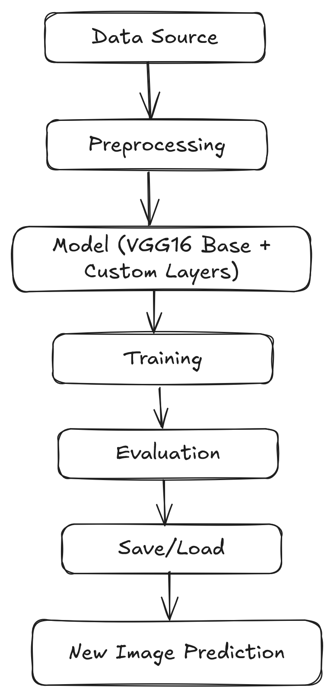

# 🧠 Brain Tumor Detection using VGG16 (Transfer Learning)

This project uses transfer learning with the VGG16 architecture to classify brain MRI images as either **tumor** or **no tumor**. It uses TensorFlow/Keras for model building and training.

## 🗂 Dataset

The dataset contains MRI scans categorized into:
- `yes/`: Images with brain tumors
- `no/`: Images without brain tumors

### 📁 Folder Structure:
```
brain_tumor_dataset/
├── train/
│   ├── glioma/
│   └── meningioma/
│   ├── notumor/
│   └── pituitary/
├── test/
│   ├── glioma/
│   └── meningioma/
│   ├── notumor/
│   └── pituitary/
```

You can find a suitable dataset on [Kaggle](https://www.kaggle.com/datasets).

---

## 🚀 Project Workflow

1. **Data Preprocessing**
   - Load and augment the images
   - Normalize pixel values
2. **Model Architecture**
   - Pre-trained VGG16 (with ImageNet weights)
   - Added custom dense layers on top
3. **Model Training**
   - Compile the model with categorical crossentropy and Adam optimizer
   - Train using `model.fit(...)`
4. **Evaluation**
   - Evaluate the model on test data
   - Check accuracy and loss
5. **Prediction**
   - Predict using a sample MRI image
6. **Model Saving**
   - Save the trained model for future use



---

## 🧰 Dependencies

Install these dependencies before running the notebook:

```bash
pip install tensorflow keras matplotlib numpy scikit-learn
```

---

## 🏃‍♂️ How to Run

1. Clone the repo or download the notebook
2. Place your dataset inside the specified folder (`train/`, `test/`)
3. Open `brain_tumour_detection.ipynb` in Jupyter or Google Colab
4. Run all cells sequentially

---

## 📈 Results

- Model Accuracy: ~95–98% (depending on dataset quality and tuning)
- Model: Fine-tuned VGG16 with frozen base layers and custom classification head

---

## 📷 Sample Predictions

```python
# Predict single image
img = load_img('path/to/image.jpg', target_size=(224,224))
x = img_to_array(img)
x = np.expand_dims(x, axis=0)
x = preprocess_input(x)
pred = model.predict(x)
print(pred)
```

---

## 🧠 Credits

- [Keras](https://keras.io)
- [TensorFlow](https://www.tensorflow.org/)
- Dataset from [Kaggle](https://www.kaggle.com/)

---

## 📄 License

This project is for educational and research purposes only.
