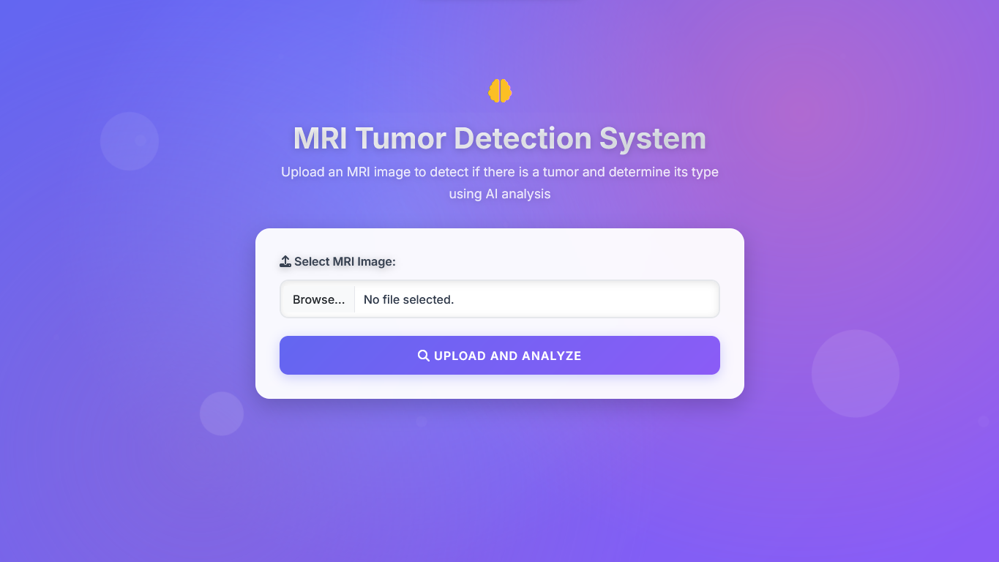
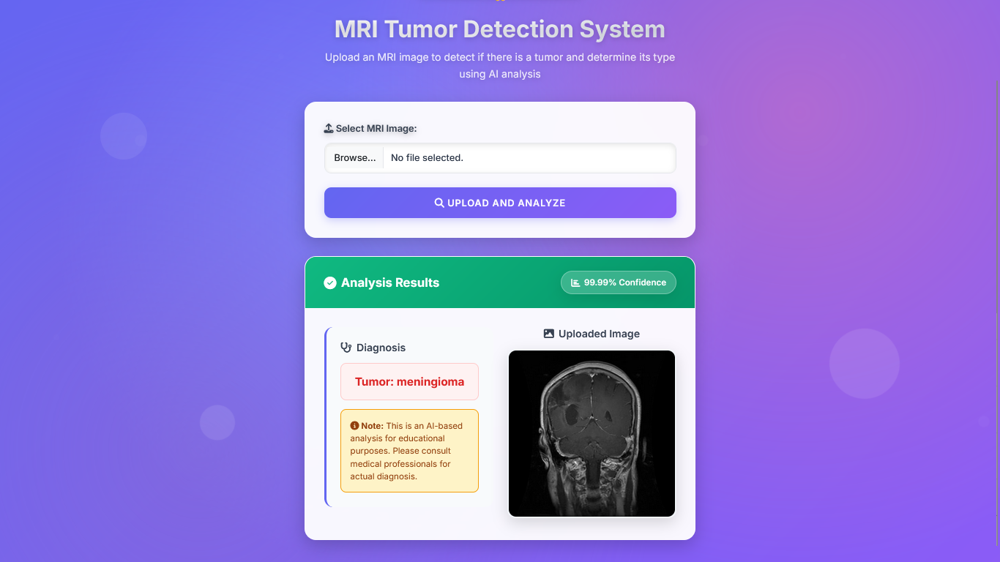

# Brain-Tumor-Detection-Deep-Learning

## Project Proposal: https://github.com/GalacticSyntax/Brain-Tumor-Detection-Deep-Learning/blob/main/deep-learning-project-proposal.pdf

## Video: https://youtu.be/wdZthFy29FE?si=lpnN4s7n-ab44Olq

## Dataset: https://www.kaggle.com/datasets/masoudnickparvar/brain-tumor-mri-dataset

## Presentation Slide: https://github.com/GalacticSyntax/Brain-Tumor-Detection-Deep-Learning/blob/main/Presentation.pptx

## Model: https://drive.google.com/drive/folders/1z8eNboFK9IFbHI-rmxHEiCgvOI5v886m?usp=sharing

